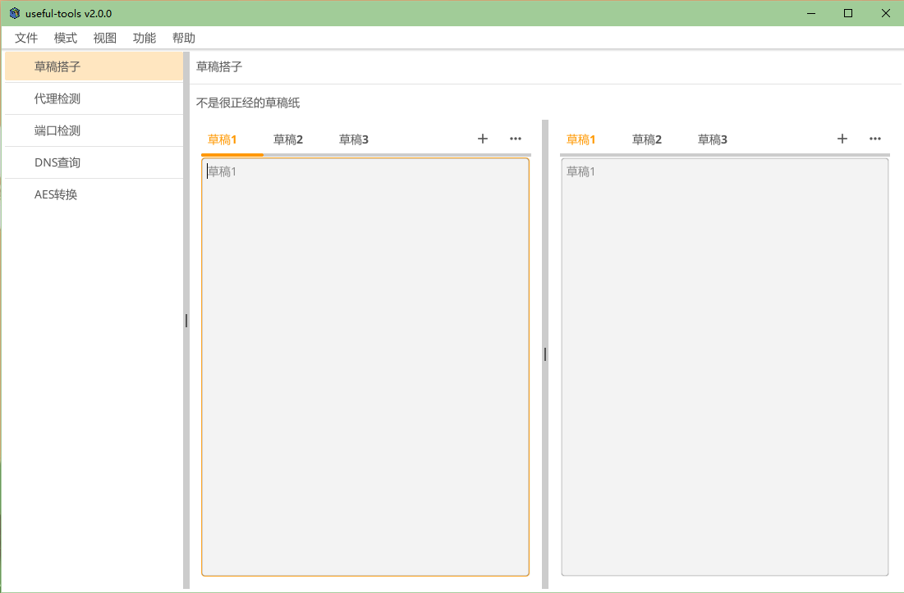
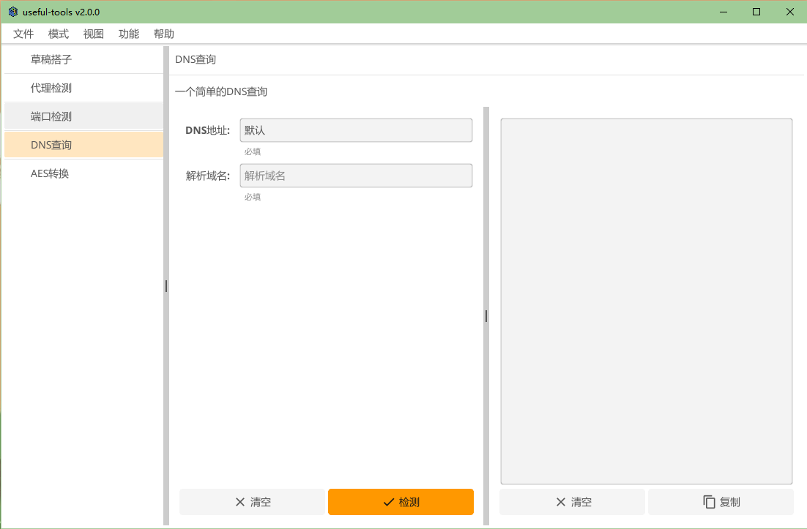
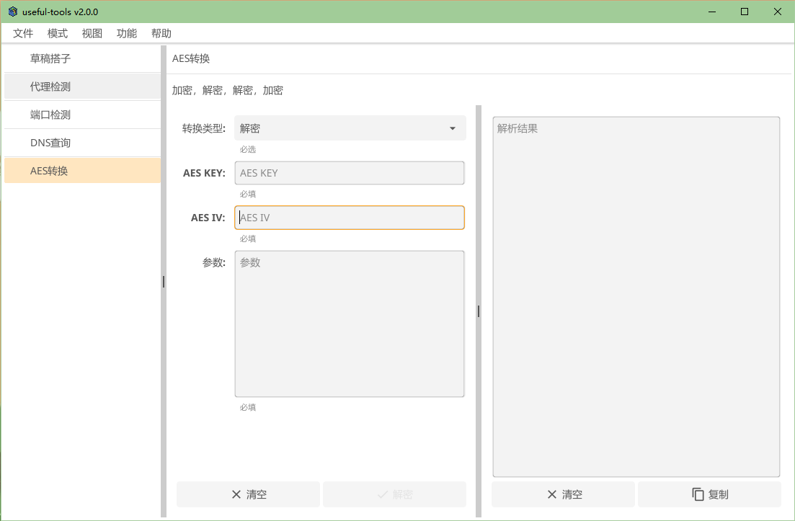

# Useful-tools
**useful-tools** 是方便平常开发，测试和运维的小工具集合。

## 下载
[Useful-tools](https://github.com/fanyiguang/useful-tools/releases)

## 功能介绍

### 菜单栏功能
1. **模式 > 专业模式：** 可以切换至专业模式
2. **视图 > 隐藏消息体：** 可以隐藏请求响应的body只显示header
3. **功能 > 隐藏AES密钥：** 会保存上一次AES加解密的密钥
4. **功能 > 关闭自动更新：** 软件带有更新功能，开启这个将关闭更新功能

### 草稿搭子
  
是处理和记录临时文本的不二之选，Ctrl+⬆/Ctrl+⬇ 可以进行翻页，Ctrl+=可以增加草稿页面，模拟真实草稿本一般。

### 代理检测
#### 普通模式
  
支持SOCKS5，SSL，SSH，HTTP，HTTPS，SHADOWSOCKS 6种代理的检测，输入对应的参数点击检测结果就会输出到右侧的文本框中。

### 端口检测
#### 普通模式
  
支持使用自选或随机本地网卡发送TCP/UDP请求到对应的IP端口，结果会输出到右侧的文本框中。

### DNS检测
#### 普通模式
  
默认使用本地配置的dns Server。

### AES转换

密钥支持十六进制格式和字符串格式
